<p align="center">
  
</p>

<h1 align="center">SatAlite</h1>

<p align="center">
  <b>Predicting how a concrete pour will cure, from air temperature measured street by street.</b><br>
  <sub>By: Muaz, Razan, Krish</sub>
</p>

---

## The thing nobody writes down

A concrete cube goes into a curing tank at a controlled 27 °C. Twenty-eight days later somebody crushes it, writes a number on a form, and that number becomes the evidence that the structure is strong enough.

Meanwhile the actual element — the bent cap, the slab, the column — sat outdoors. In Phoenix in July it sat in 44 °C air, generated its own heat as the cement hydrated, cooked its own core to something well past the air temperature, then cooled through a 15 °C night while the cube in the tank felt none of it.

**Concrete gains strength on temperature × time, not on the calendar.** The cube and the element did not experience the same temperature, so they did not gain the same strength. And the temperature the element actually experienced is never recorded. It evaporates the moment the pour finishes.

That gap has three expensive consequences:

| What goes wrong | Why | What it costs |
|---|---|---|
| **DEF** — delayed ettringite formation | The core runs past ~68 °C during hydration | Expansion and cracking that appears *years* later |
| **Thermal cracking** | The core is far hotter than the surface; the differential pulls the section apart | Cracks on day 1 of a 50-year structure |
| **Stripping formwork too early** | Strength inferred from a calendar, not from the element's own history | The unsafe direction. This is a safety-critical call |

SatAlite reconstructs the missing history. It pulls hyperlocal air temperature from the [FortyGuard](https://fortyguard.com) tOS Enterprise API, runs it through a 2D finite-volume thermal solver coupled to a cement hydration model, and returns a **decision** (when to place) and a **document** (what happened).

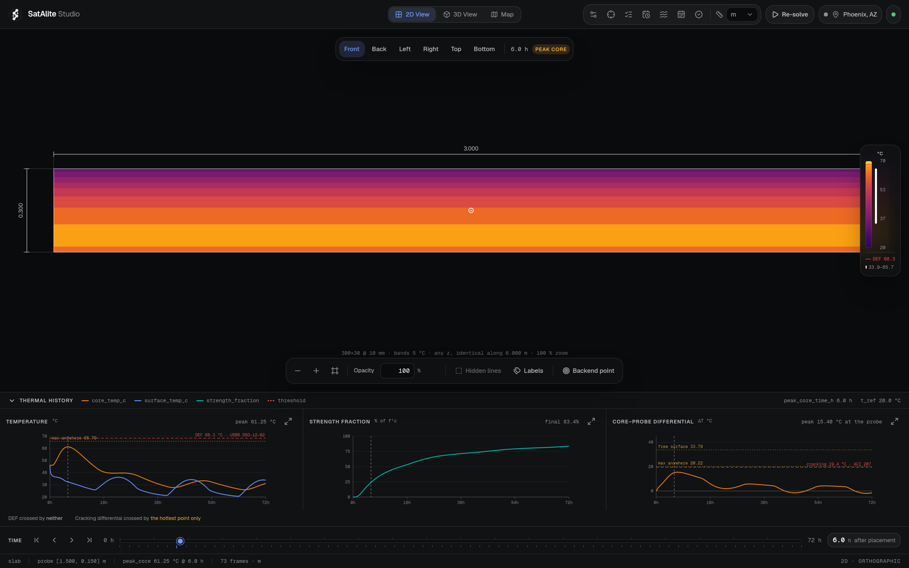
<sub>*The studio, opened on the demo scenario: a 300 mm slab in downtown Phoenix on 15 July 2025. The scrubber has jumped to peak core — 61.25 °C at 6.0 h. The three scopes along the bottom are temperature, strength fraction and the core-to-surface differential, each on its own scale, each annotated with the standard its limit comes from.*</sub>

The name is **satellite + alite** — C₃S, tricalcium silicate, the cement phase with the highest heat of hydration. We are named after the compound generating the heat we model.

---

## Part 1 — The negative result that became the product

We started with the obvious hypothesis: air temperature varies street by street, so *where* you pour matters.

We bought the data to check. Here is what a FortyGuard heatmap over one downtown Phoenix block actually returns — 221 tiles at 100 m, one whole day, `filter_type=3`:

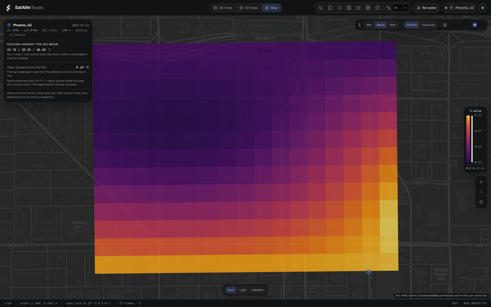
<sub>*Every other view in the studio draws a solve. This one draws the observation the solve was built from. 221 tiles, Esri basemap, and a legend that reads 36.91 → 37.01 °C.*</sub>

Read that legend again. **The entire spatial spread of the daily mean across 2.5 km² is 0.10 °C.**

We measured it at three scales, and the picture holds:

| AOI | Area | sd(mean T) | range |
|---|---|---|---|
| Downtown | 2.52 km² | 0.033 °C | 0.099 °C |
| Mid | 15.95 km² | 0.041 °C | 0.127 °C |
| Large | 119.59 km² | 0.103 °C | 0.513 °C |

Meanwhile **a single tile swings 32.80 → 40.28 °C in one day.** Diurnal variation is **75× spatial variation.**

That is not a broken API, and this matters. `tcm` is 2 m *air* temperature. Daytime convection homogenises the near-surface layer; at night the boundary layer decouples and local urban heat island shows up. Our elevation-controlled land-cover test (tarmac against urban core, 6 m apart in elevation) reads **+0.56 °C at 05:00 and −0.08 °C at 15:00** — signal at dawn, none in the afternoon. That is textbook boundary-layer behaviour, measured.

So we turned the product around. **SatAlite is temporal, not spatial.** The question is not *which corner of the block*, it is *which hour of the day, and what happens over the following 72*.

We kept the hyperlocal claim honest rather than dropping it. Click a cell on that map and the studio re-shapes the diurnal curve from that one 100 m tile's own min/mean/max instead of the AOI average. Over this block the two most different cells are **0.37 °C apart in daily minimum, which moves peak core temperature by 0.048 °C.** Real, measurable, and small — because 2.5 km² is small. The map exists so that flattening is visible rather than implied.

---

## Part 2 — What the API actually costs, and how we spent it

Everything below we paid to learn.

- **Coverage is the United States only.** Non-US coordinates return errors or nothing.
- **Auth is an `api-key` header**, not `Authorization: Bearer`. First thing to get wrong.
- **Every analysis endpoint is async**: submit, get an `activity_id`, poll `GET /v1/status/{id}` until `succeeded`. The payload lives under `["result"]`.
- **Calls are deterministic** — identical requests reproduce to four decimals. That is what makes caching provably safe rather than merely convenient.
- **`filter_type=3` returns per-tile min, mean *and* max in one call.** Asking for the three separately costs three times the credits for the same three numbers.
- **A heatmap is a flat 4220 credits**, regardless of area, granularity, filter or analytic. Our budget was 2,000,000 — about **474 calls, full stop.**

That last number shaped the whole architecture. From `AGENTS.md`, written on day one:

> **Never call the FortyGuard API without going through `app/services/cache.py`.** The cache is load-bearing, not an optimisation. Never call twice for identical params.

Which is why the studio can price a click before it spends anything:

```console
$ curl "…/api/ambient/quote?lat=33.45&lon=-112.07&date=2025-07-15"
{"in_coverage":true,"coverage":"continental US","mode":"archive","cached":true,"credits":0}

$ curl "…/api/ambient/quote?lat=30.2672&lon=-97.7431&date=2025-07-15"
{"in_coverage":true,"coverage":"continental US","mode":"archive","cached":false,"credits":4220}
```

`/api/ambient/quote` never calls FortyGuard at all, so the location picker can ask on every keystroke for nothing. `POST /api/ambient` without `allow_live: true` **refuses and names the price** instead of paying it, and spending needs a second, explicit click on a button carrying the number. The map view can never spend a credit at all — `GET /api/heatmap` reads the cache and returns a 409 naming the 4220 if the day is not on disk.

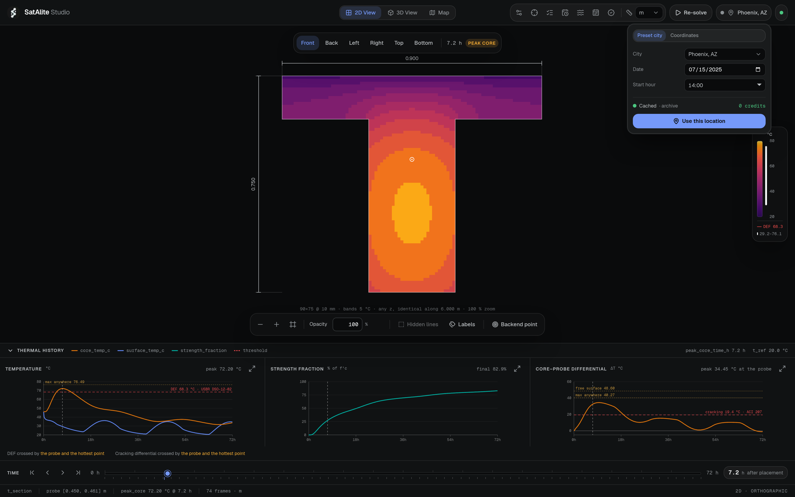
<sub>*Left: the same weather, the same mix, a T-section instead of a slab — the core blob is the whole story. Right: the location control, reporting `Cached · archive — 0 credits` before anything is spent. Latitude is not a caption here; it sets solar declination, sunset hour angle and daylength, so it moves the whole 4 a.m.-against-2 p.m. comparison.*</sub>

### One real call, and what came back

This is the request that bought the demo day. Nothing here is illustrative — the response is read straight out of the committed cache file, which ships in the repo so the demo runs with no network and no credits:

```json
{ "data": { "activity_id": "4de0ef74-3555-4df5-a5a8-215cf9d87a3e" } }
```

```json
"properties": {
  "tile_id": 0,
  "average_temperature": 37.0027,
  "min_temperature": 32.7982,
  "max_temperature": 40.2827
}
```

**Those numbers are Celsius.** The vendored client's own docstring claims `tcm` tiles are Fahrenheit and it is **wrong** — verified against live data. Read as Fahrenheit, 32.8–40.3 becomes 0.4–4.6 °C in the middle of an Arizona summer. This is the single unit error most likely to produce confidently wrong output in this codebase, so it is checked at the boundary and written down in three places.

Two more traps from the same family: `cloud_cover_octas` is actually **percent, 0–100**, despite the name. And `H_u` is regressed in **J/g** while the solver needs **J/kg** — a factor-1000 error there still produces a smooth, plausible-looking curve.

And what does the solver actually receive from all 221 tiles?

```json
{ "date": "2025-07-15", "day_of_year": 196,
  "t_min_c": 32.7778, "t_mean_c": 36.9489, "t_max_c": 40.2046, "n_tiles": 221 }
```

Three numbers. That reduction is why the map view exists.

---

## Part 3 — The physics

The governing equation is a 2D masked finite-volume heat equation solved on the **cross-section**, with a hydration source term that is evaluated per cell:

```
ρ·c_p·∂T/∂t = k·(∂²T/∂x² + ∂²T/∂y²) + Q̇(x,y,t)
```

2D is not a shortcut. For a prismatic element, heat flow along the length is negligible, so `T` is genuinely a function of `(x, y)` and not of `z`. 1D is the degenerate case. The 3D view is an extrusion of the 2D answer, and the studio says so on the drawing rather than in a footnote.

The chain from cement chemistry to a strip time:

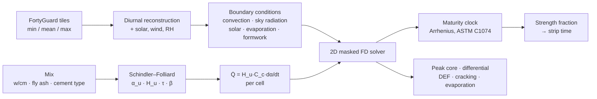

Every constant in `physics/constants.py` carries the standard it came from — ASTM C1074, USBR DSO-12-02, Schindler & Folliard 2005, ACI 207/305/347 — and the ones that are provisional say `PROVISIONAL` in the comment rather than pretending:

```python
BETA_DEFAULT = 0.9      # PROVISIONAL. eqn [11] SO3 exponent sign unconfirmed
DEF_LIMIT_C = 68.3      # 155 degF, USBR/Reclamation design max. was 70.0.
CRACK_LIMIT_C = 19.4    # 35 degF, ACI 207 / GDOT. was 20.0
PLACEMENT_MAX_C = 32.0  # PROVISIONAL. ACI 305, often project-specific
STRIP_FRACTION = 0.75   # PROVISIONAL. 70-75% of f'c, ACI 347
```

### `physics/` never imports the web

One architectural rule, enforced by a test that walks the AST of every file in the package:

> **`backend/physics/` NEVER imports fastapi, pydantic, or anything from `app/`.** It is pure numpy. This is architectural, not stylistic — it exists so the physics can be tested, reviewed and trusted in isolation from the web layer.

That rule paid for itself immediately. The Monte Carlo engine, the validation harness and the offline scripts all import the solver directly with no web layer anywhere near them.

### Choosing the grid, with a measurement instead of an opinion

An explicit scheme past its stability limit does not crash — it returns smooth garbage. So the limit `Δt ≤ Δx²/(4α)`, tightened for the Robin boundary, is asserted at runtime with the limit named in the exception.

Then we measured what each grid actually buys:

| Δx | cells | Δt used | wall time | peak core |
|---|---|---|---|---|
| 5 mm | 36,000 | 2.39 s | **74.9 s** | 61.2596 °C |
| **10 mm** | **9,000** | **9.55 s** | **6.37 s** | **61.2542 °C** |
| 15 mm | 4,000 | 21.5 s | 1.81 s | 61.2451 °C |
| 20 mm | 2,250 | 38.2 s | 0.81 s | 61.2873 °C |

Going from 10 mm to 5 mm quadruples the cell count, costs **12× the wall time, and moves peak core by 0.005 °C.** Across the whole 5 → 20 mm range the answer moves 0.04 °C. So: 10 mm for the deterministic solve, 20 mm for the 2048-member ensemble, and the reason is written down rather than argued about.

The boundary scheme is second order, measured: **p = 2.0498** baseline, 2.0067 with the film off, 2.0053 for the sealed adiabatic control.

---

## Part 4 — Five golden tests, none of which lock in our own output

This is the part we are most confident about, and the reason is simple: **not one of the five golden tests stores a number this solver produced and checks that it still produces it.**

| # | What it checks | Why it is external |
|---|---|---|
| **1** | Adiabatic rise = `H_u · C_c · α_u / (ρ · c_p)` | Closed-form energy bookkeeping. Arithmetic that would be true if this solver did not exist. It is also what catches the J/g → J/kg error |
| **2** | Hydration off ⇒ monotone decay to ambient | A physical direction, not a stored value |
| **3** | Maturity identities, asserted to `rel=1e-12` | At constant `T`, Nurse–Saul must return exactly `(T − T₀)·t`; Arrhenius at exactly `T_ref` must return exactly elapsed time. Asserted at four reference temperatures so a module-level constant cannot make it pass by accident. Catches a Celsius→Kelvin slip |
| **4** | First law, **every timestep** | generated − lost = stored |
| **5** | Grid convergence | Halving Δx must not move peak core by more than 0.1 °C |
| **+** | **Purity** | An AST walk over `physics/` — no fastapi, no pydantic, no `app/` |

Plus one conversion we are quietly pleased with: ACI 305.1-14's own worked evaporation example — 90 °F surface, 100 °F air, 56 % RH, 18 mph wind → 0.17 lb/ft²/h — reproduces to **six digits** (0.000230554 kg/m²/s), and imperial units never escape that one function.

```console
$ uv run pytest -q
228 passed in 34.33s
```

---

## Part 5 — The studio

The frontend is a Next.js 16 studio, and it has one governing rule that took us three iterations to arrive at: **the page runs exactly one solve on its own — the first one, because every panel reads a run and there is no placeholder to draw. Every later solve comes from the button.**

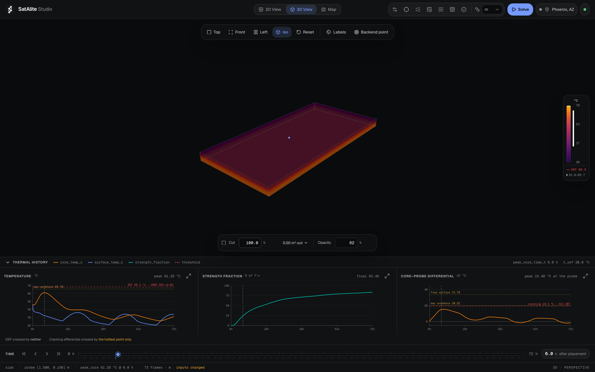
<sub>*Editing a dimension, a mix number or the cure window changes the request and nothing else. The footer says `inputs changed`, both Solve buttons turn blue, and the drawing keeps showing the last real answer until a new one lands. A solve is six seconds of one CPU core — the panel must never be re-solving under a hand still on a slider.*</sub>

Three views over one solve.

**The 2D sheet** is what an engineer reads numbers off. Six orthographic views, and all six are honest about the same fact: the four elevations are *striped* rather than shaded, because there is nothing varying along the length to shade.

**The 3D view** is the same solution extruded, with a section cut that measures what it removed.

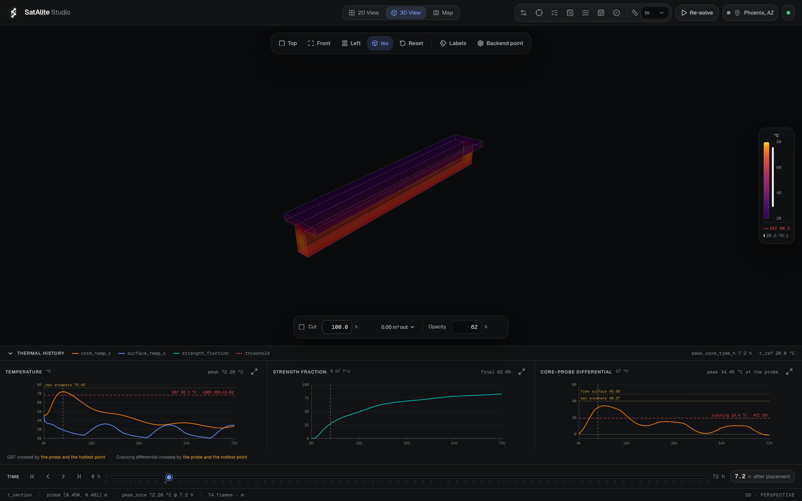
<sub>*Same weather, same mix, a T-section instead of a slab. Peak core 72.20 °C at 7.2 h against the slab's 61.25 °C at 6.0 h — and now DEF is `crossed by the probe and the hottest point`. Geometry is not a detail.*</sub>

**Click-to-probe** puts a temperature, an equivalent age and a strength at any point, at any time:

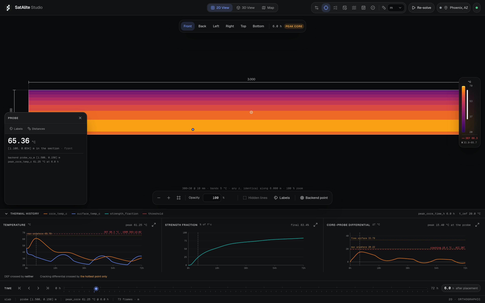
<sub>*65.36 °C at [1.106, 0.034] m — down near the formed soffit, which at 6 h is hotter than the section centroid. The card also names the backend's own probe point, so the reader can see the viewer and the solver agreeing on the same stencil rather than being told they do.*</sub>

### The panels annotate; they never adjudicate

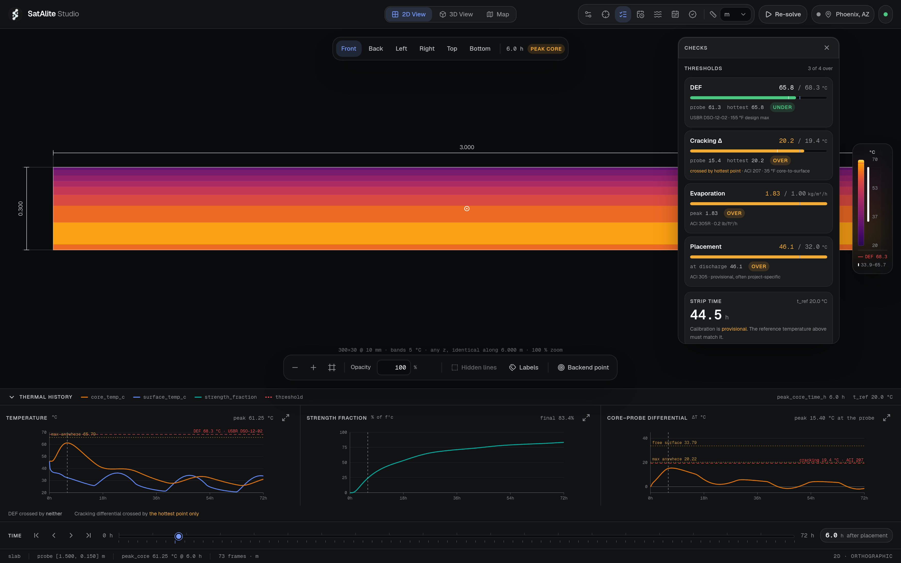
<sub>*Every number is a field of the response, sitting next to the threshold it was tested against, the quantity that tripped it, and the standard the limit came from. The bar is doing work four paragraphs of prose used to do badly: how close a quantity is to its limit is a ratio, and a ratio reads faster as a length.*</sub>

Note what this panel does **not** do. It never says a pour will crack, or that it is safe to strip. It states the measured value, the limit and the provenance, and leaves the call to the engineer reading it. `STRIP TIME 44.5 h` carries `Calibration is provisional` in the same card — because it is.

### Inputs

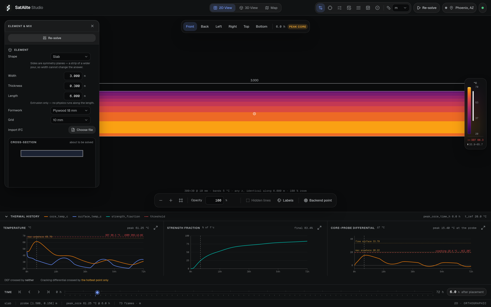
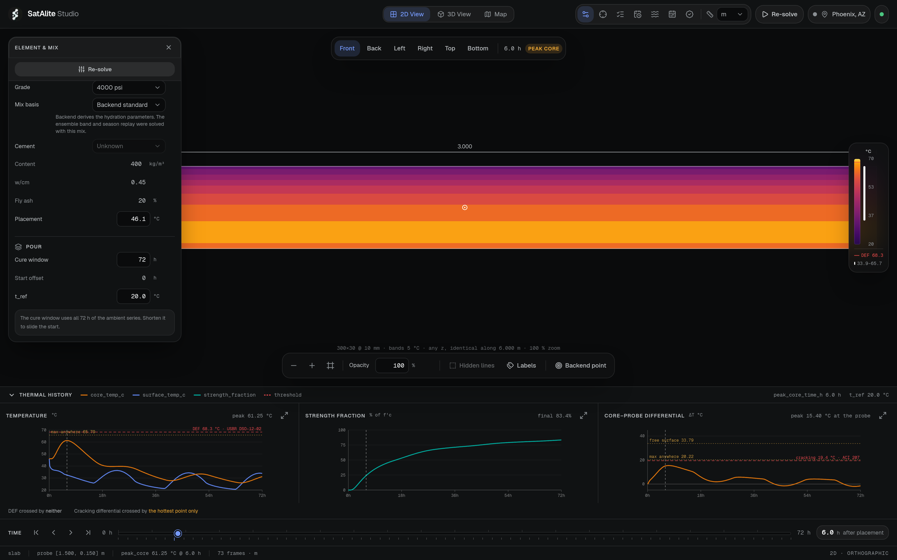
<sub>*Eight shapes (slab, wall, rectangular and circular column, beam, T-, I- and L-section), four formwork options (bare, 18 mm plywood, steel, insulating blanket), a grid selector and IFC import. The mix panel is where a real subtlety lives:* `cementitious_kg_m3` *is total cementitious content — cement plus fly ash plus any other SCM. It used to be called* `cement_kg_m3`*, which said the opposite of what it held; the old name is still accepted on the wire so existing payloads keep working.*</sub>

There is deliberately **no slag field**. Slag is not inert — it carries a 461 J/g heat term, an `α_u` term and a `τ` term. Accepting it without wiring those would model it as inert and **under-predict** temperature, which is the direction that misses a DEF flag. Until a validation case contains slag, a slag mix is simply not expressible. The constants exist in the code and are unreachable from the API on purpose.

### The pour window

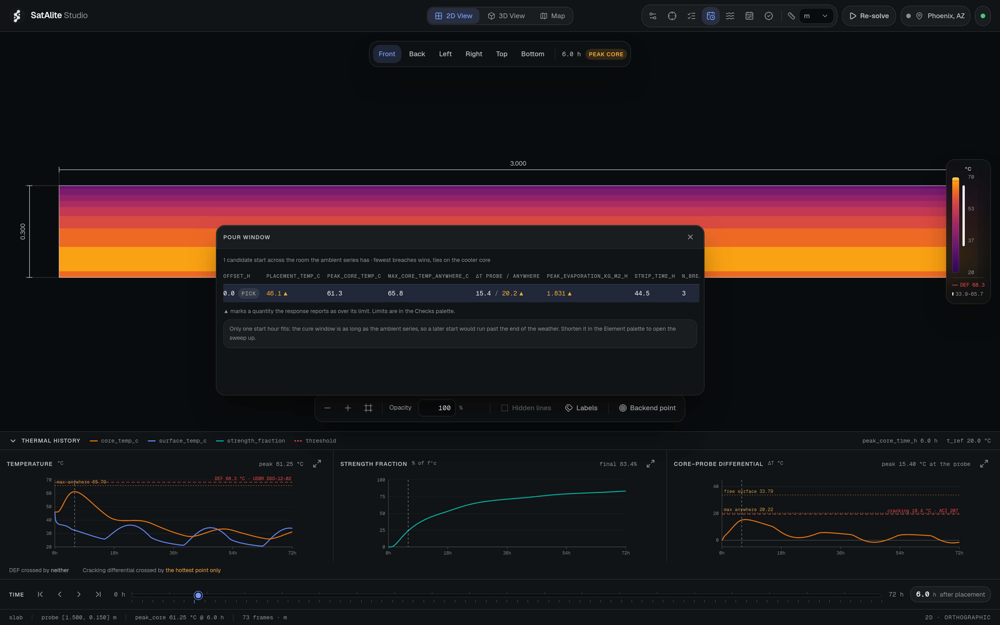
<sub>*One candidate start, and the panel explains exactly why: the cure window is as long as the ambient series, so a later start would run past the end of the weather.*</sub>

Shorten the cure window and the sweep opens up. Against the demo day's series (which begins at 14:00), a 24 h cure at three offsets:

| offset from series start | peak core | max anywhere | ΔT probe / anywhere | breaches |
|---|---|---|---|---|
| **+4 h** | **56.78 °C** | 61.52 °C | 14.48 / 19.21 | **2** ← best |
| +14 h | 60.05 °C | 63.23 °C | 11.06 / 14.76 | 2 |
| +22 h | 63.49 °C | 67.61 °C | 15.49 / **20.22** ▲ | 3 |

Ranking is by breach count, ties broken on the cooler core. All five checks are reported independently and never collapsed into one score — the core is simultaneously the highest-maturity and the highest-DEF-risk region of the element, and no single scale can say both.

---

## Part 6 — Uncertainty: an honest band, not a prettier number

A single deterministic run reports peak core temperature to a hundredth of a degree while sitting on a heat of hydration good to maybe ±8 % and a surface film coefficient good to maybe a factor of two. So we put the spread on the screen.

Ten parameters are sampled: placement temperature offset, film multiplier, τ, β, solar absorptivity, k, ρ·c_p, activation energy, cement heat, and a forecast deviate.

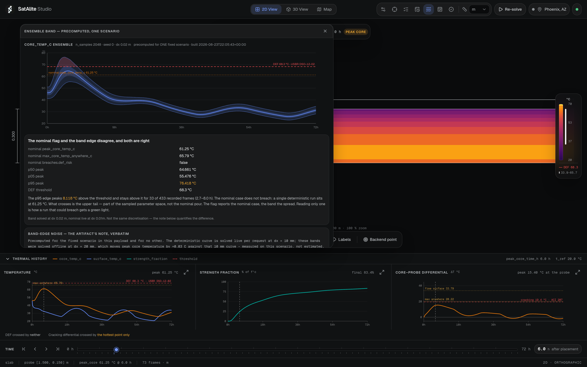
<sub>*2048 samples, scrambled Sobol, seed 0. And the one thing on this screen that must not read as a contradiction, labelled rather than hidden.*</sub>

That panel is our favourite piece of UI in the project, because it refuses to resolve a tension that is real:

> **nominal `breaches.def_risk` = false. p95 peak = 76.418 °C. DEF threshold = 68.3 °C.**
>
> Both are correct. One is a single deterministic run at 61.25 °C; the other is the upper tail of a sampled parameter space, 8.118 °C above the threshold and above it for 33 of 433 recorded frames (2.7–8.0 h). *The flag reports the nominal case, the band reports the spread. Reading only one is how a run that could breach gets a green light.*

Three engineering decisions behind that band:

**Scrambled Sobol, not pseudorandom.** It is the band *edges* that pay for clumping in a ten-dimensional parameter box. We measured it across five seeds:

| sampler | n | p05 sd | p95 sd | p95 seed-to-seed range |
|---|---|---|---|---|
| pcg64 | 300 | 0.587 °C | 0.847 °C | 2.147 °C |
| **sobol** | **300** | **0.350 °C** | **0.347 °C** | **0.902 °C** |
| pcg64 | 600 | 0.421 °C | 0.962 °C | 2.610 °C |
| sobol | 600 | 0.128 °C | 0.285 °C | 0.603 °C |

At n = 300 Sobol delivers roughly the seed-stability that pseudorandom sampling does not reach at n = 600, for the same wall time. Owen scrambling is what keeps it seedable — a raw Sobol sequence is the same points every time and has no seed to vary at all.

**Forecast error is correlated in time, not independent per hour.** One deviate per sample, widened by lead time. Hour-by-hour independent noise averages out over a 72 h run and collapses the band to nothing — but the real failure mode is a forecast that runs warm *all afternoon*.

**Every sample is drawn in the parent process before any work is dispatched.** Workers receive finished numbers and draw nothing, so the result does not depend on the pool size, the scheduling order, or the day of the week.

---

## Part 7 — Season replay

One element, fixed before the run and never tuned afterwards. 30 days drawn every third day across an 88-day Phoenix summer. Two placement hours.

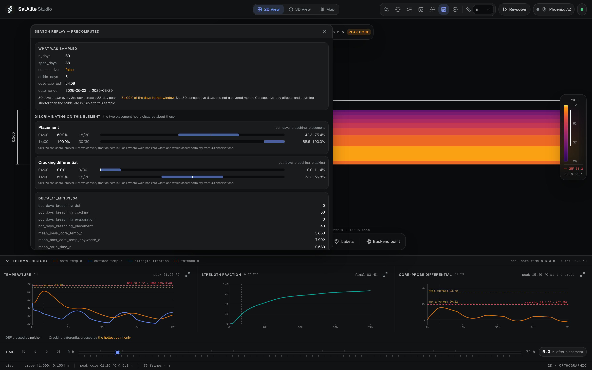

| flag | 04:00 | 14:00 | Δ |
|---|---|---|---|
| Placement temp | 60.0 % (18/30) | 100 % (30/30) | +40 |
| **Cracking differential** | **0.0 % (0/30)** | **50.0 % (15/30)** | **+50** |
| Evaporation | 100 % | 100 % | 0 |
| DEF | 0 % | 0 % | 0 |
| mean peak core | 53.23 °C | 59.09 °C | +5.86 °C |

The panel does something we think is unusual for a hackathon dashboard: it says out loud that **only one of the four flags separates the two placement hours.** The other three fire identically at both and therefore carry no information about *when* to pour this element. Presenting four rows as four decision signals is how "unsafe, always" gets read as advice.

Every fraction carries a **95 % Wilson score interval**, not Wald — because every fraction here is 0 or 1 somewhere, where Wald has zero width and would assert certainty from 30 observations. `0.0 %` is drawn as `0.0–11.4 %`.

And the sampling is described rather than glossed: 30 days, stride 3, 34.09 % coverage of the window. Consecutive-day effects, and anything shorter than the stride, are invisible to this sample. It says so on the panel.

---

## Part 8 — Where it is wrong

This is the section we would keep if we had to delete every other one.

A thermal model that does not say where it is weak is not evidence, it is a picture. `docs/LIMITATIONS.md` is 417 lines long, it ships in the repo, and the studio serves the failure report to the user's own screen:

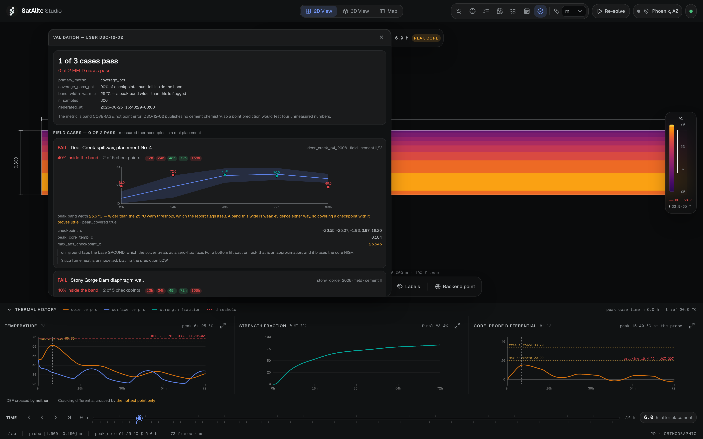

### 8.1 Validation stands at 1 of 3

Three cases from USBR DSO-12-02 (public domain, real instrumented placements). The metric is **band coverage**, not point error — DSO-12-02 never publishes C₃A, C₃S, SO₃ or Blaine for either cement, so a point prediction would be a test of four numbers nobody measured.

| case | kind | coverage | peak band width | median peak error |
|---|---|---|---|---|
| `deer_creek_adiabatic` | adiabatic | **100 %** (1/1) | 23.47 °C | +5.93 % on rise |
| `deer_creek_p4_2008` | field | **40 %** (2/5) | 25.57 °C | +0.10 °C |
| `stony_gorge_2008` | field | **40 %** (2/5) | 21.76 °C | −7.89 °C |

Both field cases fail, **and both fail the same way in the same direction**: badly cold at 12 h and 24 h (−26.5 and −25.1 °C at Deer Creek; −28.1 and −23.6 °C at Stony Gorge), crossing to warm by 168 h. That is a shape error in the early-age curve, not scatter.

Deer Creek's +0.10 °C headline peak error sits *inside a 25.6 °C band that exceeds our own 25 °C warn threshold*, and the report flags itself: a band that wide contains almost any outcome. We read that agreement as a coincidence of a wide band and a badly reconstructed early-age curve, not as a demonstration of accuracy.

### 8.2 The differential reads far too high

Seven instrumented Alabama DOT mass-concrete elements (Auburn / ALDOT 930-860R). **Nothing in this codebase has ever been fitted to them.**

| Element | measured max ΔT | predicted | error |
|---|---|---|---|
| Albertville bent cap | 22.2 °C | 48.2 °C | **+26.0** |
| Harpersville crashwall | 23.3 °C | 47.7 °C | +24.4 |
| Scottsboro pedestal | 37.8 °C | 61.7 °C | +23.9 |
| Scottsboro bent cap | 27.8 °C | 58.9 °C | +31.1 |
| Elba bent cap | 11.7 °C | 46.3 °C | +34.6 |
| Birmingham column | 10.6 °C | 46.3 °C | **+35.7** |
| Brewton bent cap | 21.1 °C | 36.4 °C | +15.3 |

The cracking limit is 19.4 °C, so this predicts a breach on **every one of them**, including two that measured barely half the limit. A flag that fires on everything carries no information.

**Part of it was the measuring point, and that part is fixed.** ACI 301's 35 °F is written against a thermocouple cast a few inches under a face; the modelled *free surface* at 4 a.m. is much colder than that reading. We were comparing one physical quantity against another's limit. The solver now reports a surface probe at a settable depth (default 50 mm) and the cracking flag is evaluated on that.

How much did that alone move? The season replay headline, rebuilt on the same 30 days with nothing changed but the point the limit is read at:

| | free surface | surface sensor |
|---|---|---|
| `pct_days_breaching_cracking` @ 04:00 | 100.0 % | **0.0 %** |
| `pct_days_breaching_cracking` @ 14:00 | 100.0 % | **50.0 %** |

A statistic that read 100 % at both placement hours said nothing at all. The corrected one separates them completely — which is the exact comparison the season replay exists to make.

**Most of it was not the measuring point, and that part is unfixed.** Sweeping the sensor depth on Birmingham: 46.3 °C at the free surface, 42.9 at 25 mm, 40.7 at 50 mm, 34.7 at 100 mm, **29.5 at 150 mm — against a measured 10.6.** Depth is worth about 5 °C at 50 mm and 17 °C at 150 mm, against a disagreement of 24 to 36 °C.

Peak *core* temperature on the same seven runs is roughly right (mean absolute error 5.40 °C). So the core is not the problem: **the modelled surface runs far too cold.** That points at the boundary — the convective film, the sky radiation deficit, the formwork resistance, or the evaporative term — and nothing in this build corrects it.

### 8.3 The peak arrives late, and it is a bias

Same seven elements, error on time to peak core temperature:

```
Albertville  +14.7 h    Scottsboro pedestal   +8.2 h    Birmingham  +3.2 h
Harpersville  +2.3 h    Scottsboro bent cap   +6.0 h    Brewton    +14.2 h
Elba         +12.0 h
```

**Mean +8.7 h, and all seven errors are positive.** Our own acceptance criterion is ±8 h; four of seven miss it. The peak *temperature* on the same runs is not biased that way — four positive, three negative, mean +0.9 °C. So the model gets roughly the right peak at roughly the wrong time. Same diagnosis as §8.1, reached from a second, independent dataset — and reached here with *measured* hourly weather, so the ambient reconstruction we blamed the first time cannot be the whole of it.

### 8.4 One constant was fitted to a validation case

`H_CEM_DEFAULT` is 500 J/g. It was 470. The comment says why:

```python
H_CEM_DEFAULT = 500.0   # J/g when the cement type is unknown. USBR DSO-12-02.
# was 470: field data shows it under-predicts. Stony Gorge measured rise 104 degF
# against 96 predicted. Modern cements grind finer, so more heat per unit binder.
```

Stony Gorge is validation case 2. Our own decision log says chemistry was deliberately not tuned to the field data; **this is the one place that rule was broken**, and it is the reason the rule is worth stating. Stony Gorge's agreement is therefore not independent evidence about that constant. The rest of the hydration chain is untouched: the Schindler–Folliard regressions were transcribed from the paper and no coefficient in them has moved.

### 8.5 The forecast error band is invented

`provisional_error()` returns a sigma ramping from 0.5 °C at 1 h lead to 2.0 °C at 12 h, with `n_pairs = [0] * 12`. **Zero measured pairs.** The function says so about itself: *"a plausible shape for a short-range near-surface forecast, NOT a measurement of this API."*

That invented sigma widens the ambient in every ensemble member, so it feeds every published p05/p95 band. And it matters more than its size suggests. In the one-at-a-time sensitivity sweep, `forecast_z` ranks **9th of 10 on peak core temperature** (worth 1.01 °C) but **2nd of 10 on strip time** (worth −5.67 h), behind only the activation energy. The strip-time band is substantially made of a parameter nobody has measured.

The machinery to replace it exists and is tested — `empirical_forecast_error()` pairs cached forecasts against later observations for the same tile. It has no data yet.

### 8.6 And the honest scope line

**This is not an ASTM C1074 maturity instrument.** C1074 requires the temperature history to be *recorded*. We predict it. A predicted maturity is not a measured maturity, and no amount of agreement makes it one.

What we do claim: **planning** (deciding when to pour, before there is anything to instrument), **what-if** (move the mix, the section, the formwork or the start hour and see where the peak goes), and **reconstruction** (rebuilding what a placement experienced, after the fact). If a specification calls for maturity-based acceptance, it calls for a thermocouple.

Two more we disclose and do not solve: silica fume is carried as **mass with no heat**, because Schindler–Folliard has no silica-fume term at all — that biases predictions cold. And `physics/strength_model.py` is labelled PROVISIONAL in its own comment, is not measured on any mix here, and has no dedicated test file. Optimistic is the unsafe direction for a strip time.

---

## Part 9 — What was actually difficult

The commit log is written in the same voice as the code. A selection of the fights:

**`DT WAS WRONG ANSWER. PROBE STENCIL WAS RIGHT ONE.`**
The core temperature moved when we changed the grid. The instinct was to blame the timestep. The real cause was that "the core" was being read as *a cell*, and a different Δx means a different cell. The fix was to make the probe a fixed physical *point* sampled bilinearly, so the reported number stops moving when Δx does.

**`SEAL FILM ON SEALED FACE. ADIABATIC SURFACE STOP LYING.`** and **`ATTENUATE Q LIKE H.`**
Two bugs in the same region of code, both invisible in the output. Adiabatic runs were rebuilding a surface gradient out of nothing, because the sky-radiation deficit was still being applied to faces that carried no flux. And the external face flux was skipping the half-cell of concrete between the face and the cell centre, while the film coefficient was not — one attenuated, one raw, quietly first-order.

**`ON_GROUND REFUSE, NOT PRETEND.`**
A `GROUND` face carries zero flux in this solver, which is a perfectly insulated base. It over-predicts peak core (fine — DEF flags early) but it also **over-predicts maturity, so strip times come out early**, which is the unsafe direction and the one a contractor acts on. Rather than ship it, `ElementSpec` now rejects `on_ground=True` outright and says why. The validation harness still uses it, and `LIMITATIONS.md` §2 measures what that costs (+0.085 °C on median peak, against the +2.5 °C we had guessed).

**The ensemble ate 30 GB and the parent was OOM-killed.**
A 72 h run at 20 mm holds 433 frames × 2250 cells in two field arrays — 15 MB per sample, times 2048. The parent only ever reduced those frames to one series anyway, so we moved the reduction into the worker. Same arithmetic on the same array: **30 GB on the wire became 10 kB.**

**`forkserver`, and a preload that hangs forever.**
`fork()` inside a threaded process (uvicorn, pytest) can deadlock in the child. `forkserver` fixes it. What is *not* documented anywhere useful: calling `set_forkserver_preload` with these modules hangs the pool outright — workers stop being created and one process spins at 100 % indefinitely. Measured, not theorised: 300 samples went from 56 s to still-running at 200 s. There is now a comment in the code that says exactly that, so nobody re-adds it.

**`THE DIFFERENTIAL CHART DREW THE WRONG SURFACE.`**
After the cracking flag moved to the surface probe, the chart was still drawing the free-surface differential under the probe's label. The panel had the right series in hand and plotted the other one.

**CARTO started stamping `API KEY REQUIRED` across every tile it served.** Mid-build. We moved the basemap to Esri (Dark Gray Canvas, Light Gray Canvas, World Imagery), no key, attribution drawn on the map because that is the licence condition — and `basemap.ts` now *refuses* a custom tile source that supplies no attribution rather than half-applying it.

**Next 16 holds a one-dev-server lock per directory**, and `NEXT_PUBLIC_*` is inlined at *build* time, not read at runtime. Both cost us an afternoon and both are now in the README so they cost the next person nothing.

---

## Part 10 — Making it deployable

The binding number is that **one deterministic solve is 6.14 s of wall time on one core** — measured through `POST /api/simulate`, four warm runs at 6.154 / 6.135 / 6.130 / 6.149 s, dt = 10 s, 25,920 steps, 30×300 grid, 433 recorded frames — with a **285 MiB peak RSS**.

That rules out the obvious free tiers. Render's free instance is 512 MB and **0.1 CPU**, which turns 6.14 s into roughly a minute. Hugging Face now requires a paid plan for Docker Spaces. Fly wants a card with no documented free allowance.

**Google Cloud Run works.** Its always-free tier is 180,000 vCPU-seconds a month in Tier 1 US regions — about **29,300 free solves a month** at 6.14 vCPU-s each, on a real vCPU rather than a tenth of one. `--concurrency 2` matters: the solve is CPU-bound and single-threaded, so the default of 80 queues requests behind each other until they all time out.

The image is backend-only, builder/runtime split so uv and the build tooling never ship: **970 MB single-stage → 672 MB with the uv cache dropped → 578 MB as it stands.** That is the floor without dropping a feature; scipy alone is 152 MB of the 260 MB venv.

And three results never touch a request thread at all — the 2048-member ensemble, the season replay and the validation report are built offline and served from disk. A missing file returns a 503 naming the command that builds it. **Never a live compute, never a placeholder.**

---

## What we would do next

- **Wire the measured cement chemistry.** ALDOT 930-860R publishes the full Bogue set and Blaine fineness per element, and `MixSpec` carries no field for any of it. Albertville's certificate gives τ = 16.34 h against the 17.34 h our generic constants assume, and 462.2 J/g against the 510 used. `cement_heat_j_per_g()` already exists and is reachable from nothing. Four optional numbers through `MixSpec` is the experiment.
- **Diagnose the cold surface.** It is the single largest error in the model and it points at the boundary, not the core.
- **Feed `empirical_forecast_error()`.** The code is written and tested; it needs paired forecast/observation days in the cache.
- **Calibrate strength properly.** ASTM C1074 lab calibration, uploaded per mix. We replace the sensor, not the lab test.
- **A slag term**, once a validation case contains slag.

---

## Try it

- 💻 **Source:** [github.com/MuazTPM-YT/satalite](https://github.com/MuazTPM-YT/satalite)
- 📖 **Read before trusting a number:** [`docs/LIMITATIONS.md`](docs/LIMITATIONS.md)
- 🧪 **The validation report:** [`docs/VALIDATION.md`](docs/VALIDATION.md) · served live at `/api/validation`
- 🔧 **Setup and the full API walk-through:** [`README.md`](README.md)

---

## Sources

Everything SatAlite is built on or measured against. Every link was fetched on 2026-08-27.

**Temperature data**

1. **FortyGuard tOS Enterprise API** — hyperlocal 2 m air temperature, 100 m tiles, US only, archive from 2021-01-01, forecast to +12 h. → <https://fortyguard.com>
2. **Open-Meteo Historical Weather API** — free, hourly back to 1940, worldwide. Supplies the wind and hourly GHI FortyGuard does not carry at all; used for the Alabama runs, whose 2015–2016 dates predate the FortyGuard archive. → <https://open-meteo.com/en/docs/historical-weather-api>

**Ground truth — measured concrete, not modelled**

3. **USBR DSO-12-02** — Bartojay, K. (2012), *Thermal Properties of Reinforced Structural Mass Concrete*. Public domain. The three validation cases, the DEF threshold, the in-situ vs fog-cured strength comparison. → <https://www.usbr.gov/damsafety/TechDev/DSOTechDev/DSO-12-02.pdf>
4. **ALDOT 930-860R** — Gross, Eiland, Schindler & Barnes (2017), *Temperature Control Requirements for the Construction of Mass Concrete Members*, Auburn University HRC. Seven instrumented elements with mill certificates and a published ConcreteWorks accuracy assessment on the same seven. Nothing here has ever been fitted to them. → <https://eng.auburn.edu/files/centers/hrc/930-860r-temperature-control.pdf>

**Physics and standards**

5. **Schindler, A. K. & Folliard, K. J. (2005)**, *Heat of Hydration Models for Cementitious Materials*, ACI Materials Journal 102(1), 24–33 — the α_u, H_u, τ and β regressions. → [ACI abstract](https://www.concrete.org/publications/internationalconcreteabstractsportal.aspx?m=details&id=14246)
6. **ASTM C1074** — maturity and equivalent age: `EA_BASE = 33500`, datum −10 °C, the 20 °C slope breakpoint. → <https://www.astm.org/c1074-19.html>
7. **ACI 305.1-14** — hot weather concreting; the Uno evaporation equation, checked against the standard's own 0.17 lb/ft²/h worked example. → [ACI 305.1](https://www.concrete.org/store/productdetail.aspx?ItemID=305114)
8. **ACI 207.2R / ACI 301** — `CRACK_LIMIT_C = 19.4` (35 °F) and the 160 °F in-place maximum. → [ACI 207.2R](https://www.concrete.org/store/productdetail.aspx?ItemID=207207)
9. **ACI 347** — `STRIP_FRACTION = 0.75`, formwork removal. → [ACI 347](https://www.concrete.org/store/productdetail.aspx?ItemID=34714)
10. **ACI 306.1** — cold-weather placement. → [ACI SPEC-306.1-90](https://www.concrete.org/store/productdetail.aspx?ItemID=306190)

**Prior art we measure against**

11. **ConcreteWorks** — the benchmark. TxDOT-funded, built at UT Austin's Concrete Durability Center, free, used by several state DOTs. Its published error on the seven ALDOT elements is what our 5.40 °C is quoted against. → [TxDOT presentation](https://www.dot.state.tx.us/iheep2009/presentations/4A_ConcreteWorks_AndyNaranjo.pdf)
12. **TxDOT 0-4563-1**, *Prediction Model for Concrete Behavior* — the UT Austin report ConcreteWorks was built from. → <https://library.ctr.utexas.edu/ctr-publications/0-4563-1.pdf>
13. **HIPERPAV III** — FHWA's free early-age pavement tool: transient 1D finite difference with hydration, convection, solar and evaporative cooling. Nearly the same physics stack, one dimension fewer, federally validated. → [FHWA](https://www.fhwa.dot.gov/pavement/concrete/hiperpav.cfm)
14. **b4cast** — commercial 3D FE thermal and stress analysis of hardening concrete; the consultant-grade end of the market. → <https://b4cast.com/>

**Further reading behind the framing**

15. **UT Austin CTR 0-5218-1** — *Investigation of the Internal Stresses Caused by Delayed Ettringite Formation*, the Texas precast box-beam case. → <https://library.ctr.utexas.edu/ctr-publications/0-5218-1.pdf>
16. **GDOT Research Project 19-04 Phase II** — mass concrete thermal management, and what cooling costs. → <https://rosap.ntl.bts.gov/view/dot/64459/dot_64459_DS1.pdf>
17. **Iowa State InTrans (2025)** — *Maturity Method for Early Opening of Concrete Pavements*; a DOT that measured the payoff. → <https://www.intrans.iastate.edu/wp-content/uploads/2025/04/maturity_method_for_concrete_pvmt_early_opening_spring_2025_MB.pdf>
18. **FHWA HIF-19-005** — *Utilizing the Maturity Concept for Determining Early Strength*. → <https://www.fhwa.dot.gov/pavement/concrete/trailer/resources/hif19005.pdf>
19. **NRMCA CIP 42** — *Thermal Cracking*, the one-page industry explainer. → <https://www.concreteanswers.org/CIPs/CIP42.htm>
20. **USBR DSO-2017-05** — *Comparison of Thermal Property Models for Concrete*. → <https://www.usbr.gov/damsafety/TechDev/DSOTechDev/DSO-2017-05.pdf>

**Credit.** The FortyGuard API client in `backend/vendor/fortyguard/` is vendored unmodified from FortyGuard's quickstart, MIT licensed, with their licence kept alongside it. Thanks to FortyGuard for the API and the quickstart. SatAlite itself is MIT licensed.

**AI tools.** Written with [Claude Code](https://claude.com/claude-code) as the primary assistant: implementation, refactoring, test scaffolding and documentation. What the assistant was *not* allowed to decide: every physics constant carries the standard it came from, and the five golden tests check the solver against closed-form arithmetic and exact identities rather than against any number this code produced.
